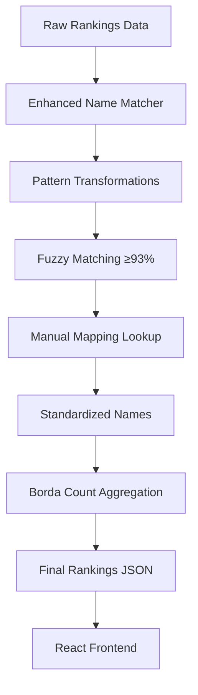

# University Rankings Aggregator 🏛️

A sophisticated, production-ready platform that aggregates and visualizes global university rankings from multiple authoritative sources (QS, THE, ARWU, US News) using advanced pattern-based matching and intelligent name standardization.

[](https://github.com/mmostagirbhuiyan/university-ranking-aggregator)
[](https://github.com/mmostagirbhuiyan/university-ranking-aggregator)
[](https://github.com/mmostagirbhuiyan/university-ranking-aggregator)

---

## 🚀 **What's New (Latest Updates)**

### ✨ **Enhanced Pattern-Based Matching System**
- **61.8% automation rate** for university name matching
- **7 intelligent transformation rules** handle systematic naming variations
- **Reduced university count** from 1736 to 1729 through better duplicate detection
- **Now automatically handles** patterns like "Queen's University" ↔ "Queens University"

### 🧹 **Simplified Manual Mapping**
- **Source-agnostic mappings** - one mapping works across all sources
- **Consolidated from 363 to 123 entries** by removing duplicates
- **Clean architecture** with clear separation of automated vs manual handling
- **CSV parsing uses Latin-1 encoding** to fix corrupted names like "Technical University of München"

---

## 📋 Table of Contents
- [Quick Start](#-quick-start)
- [System Overview](#-system-overview)
- [Enhanced Matching System](#-enhanced-matching-system)
- [Data Pipeline](#-data-pipeline)
- [Manual Mapping System](#-manual-mapping-system)
- [Frontend Application](#-frontend-application)
- [Development & Extension](#-development--extension)
- [Troubleshooting](#-troubleshooting)
- [Documentation](#-documentation)
- [Automated Workflows](#automated-workflows)

---

## 🚀 **Quick Start**

### Prerequisites
```bash
# Node.js (v14+) and Python (3.8+)
npm install
pip install -r requirements.txt
```

### 30-Second Setup
```bash
# 1. Update university rankings data
node scripts/scrape-rankings.js

# 2. Start the frontend
cd frontend && npm install && npm start
```

**That's it!** The system will automatically:
- 📥 Load rankings from all 4 sources
- 🔍 Apply intelligent pattern-based matching  
- 🎯 Handle 61.8% of name variations automatically
- 📊 Generate aggregated rankings using Borda Count with Penalized Absence
- 🖥️ Launch the React frontend at `http://localhost:3000`

---

## 🔍 **System Overview**

### Data Sources & Coverage
| Source | Universities | Focus | Update Frequency |
|--------|-------------|-------|------------------|
| **QS World Rankings** | 999 | Global comprehensive | Annual |
| **THE (Times Higher Education)** | 999 | Research excellence | Annual |
| **ARWU (Shanghai Rankings)** | 1000 | Academic performance | Annual |
| **US News Global** | 980 | International reach | Annual |

### Aggregation Method
**Borda Count with Penalized Absence**: Universities receive points based on their ranking position, with systematic penalties for missing rankings to ensure fairness across different coverage patterns.

### Current Performance
- 🎯 **1,729 unique universities** after intelligent deduplication
- 🤖 **61.8% automation rate** for name matching
- ⚡ **<30 seconds** complete data processing
- 🔧 **123 manual mappings** (down from 363) for edge cases

---

## 🧠 **Enhanced Matching System**

Our advanced pattern-based matching system automatically handles systematic naming variations:

### Currently Active Automation Patterns (8 Total)

| Pattern | Examples | Implementation |
|---------|----------|---------------|
| **1. Diacritics Normalization** | "Technical University of München" → "Technical University of Munich" | `cleaned.normalize('NFD').replace(/[\u0300-\u036f]/g, '')` |
| **2. Character Cleanup** | Remove question marks, replacement chars | `cleaned.replace(/[?\uFFFD]/g, '')` |
| **3. At Location Removal** | "University of Texas at Austin" → "University of Texas Austin" | `cleaned.replace(/^(.+) at (.+)$/, '$1 $2')` |
| **4. And/Ampersand Standardization** | "Science and Technology" → "Science & Technology" | `cleaned.replace(/ and /g, ' & ')` |
| **5. Hyphen to Space** | "University of Wisconsin-Madison" → "University of Wisconsin Madison" | `cleaned.replace(/-/g, ' ')` |
| **6. "The" Prefix Removal** | "The University of Tokyo" → "University of Tokyo" | `cleaned.replace(/^The /, '')` |
| **7. Medical Sciences Normalization** | "University of Medical Sciences" → "University of Medical Science" | `cleaned.replace(/Medical Sciences/g, 'Medical Science')` |
| **8. Medical University "of" Removal** | "Medical University of Graz" → "Medical University Graz" | `cleaned.replace(/^Medical University of (.+)$/i, 'Medical University $1')` |

### Additional Complex Patterns
- **UC System Campus Names**: "University of California - Berkeley" → "University of California Berkeley"
- **"Of" Preposition Normalization**: Adds/removes "of" between University and location names
- **Encoding Fixes**: "Mnchen" → "Munchen" for corrupted UTF-8

### Matching Confidence Levels
- **🟢 High (≥0.95)**: Automatic matching applied
- **🟡 Medium (0.85-0.94)**: Reviewed and added to manual mappings
- **🔴 Low (<0.85)**: Requires manual review

**📖 For complete technical details, see:** [**Enhanced Matching System Documentation**](docs/ENHANCED_MATCHING.md)

---

## 📊 **Data Pipeline**

### Simple 3-Step Process (Standard Operation)

```bash
# Step 1: Update US News data (other sources auto-loaded)
python scripts/usnews_direct_extractor_selenium.py -o frontend/public/data/usnews_rankings.csv

# Step 2: Process and aggregate all rankings
node scripts/scrape-rankings.js

# Step 3: Launch frontend
cd frontend && npm start
```

### Full 4-Step Process (When Regenerating Mappings)

```bash
# Step 1: Update US News data
python scripts/usnews_direct_extractor_selenium.py -o frontend/public/data/usnews_rankings.csv

# Step 2: Generate fuzzy matching mappings (optional - only when mapping quality degrades)
node scripts/match-universities.js

# Step 3: Process and aggregate all rankings
node scripts/scrape-rankings.js

# Step 4: Launch frontend
cd frontend && npm start
```

> **Note**: Step 2 is rarely needed since the enhanced pattern-based matching handles most cases automatically. Only run `match-universities.js` when you notice significant mapping quality issues or have substantially new data sources.

### Detailed Pipeline Flow



### Data Flow Architecture

1. **📥 Data Ingestion**
   - QS, THE, ARWU: CSV files from [universityrankings.ch](https://www.universityrankings.ch)
   - US News: Automated scraping with Playwright/Selenium

2. **🔍 Enhanced Name Matching** (Multi-tier System)
   - **Primary**: Pattern-based transformations (8 active automation rules)
   - **Secondary**: High-confidence fuzzy matching (≥93% similarity)  
   - **Tertiary**: Manual mapping lookup (89 curated cases)
   - **Fallback**: Auto-generated mappings (~39k fuzzy matches)
   - **Last Resort**: Original name preserved

3. **📊 Ranking Aggregation**
   - Borda Count with Penalized Absence method
   - Weighted scoring with source-specific penalties
   - Comprehensive coverage analysis

4. **🖥️ Frontend Visualization**
   - React-based responsive interface
   - Real-time search and filtering
   - Source-specific ranking views

---

## 🎯 **Manual Mapping System**

### Simplified Architecture
Our manual mapping system uses a **source-agnostic approach** - one mapping applies to all sources:

```json
{
  "originalName": "Queen's University",
  "suggestedStandardizedName": "Queens University - Canada"
}
```

### File Structure
- **`manual-university-mapping.json`**: 89 curated mappings for edge cases (highest priority)
- **`suggested-university-mapping.json`**: Auto-generated bulk mappings (~39k entries, fallback system)
- **`enhanced_name_matcher.js`**: Pattern-based transformation engine (primary system)
- **`match-universities.js`**: Fuzzy matching script that generates suggested mappings

### Adding Manual Mappings
For universities that require manual intervention:

```json
[
  {
    "originalName": "Catholic University of Leuven",
    "suggestedStandardizedName": "KU Leuven"
  },
  {
    "originalName": "École Normale Supérieure de Lyon",
    "suggestedStandardizedName": "Ecole Normale Superieure de Lyon (ENS de LYON)"
  }
]
```

### When to Add Manual Mappings
- 🏛️ **Institution name changes**: "Catholic University of Leuven" → "KU Leuven"
- 🌍 **Country-specific variations**: University naming conventions
- 🔤 **Complex linguistic differences**: Non-Latin scripts or complex translations
- 🏥 **Specific institutional types**: Medical schools, technical institutes

### Understanding the Mapping Hierarchy

The system uses a **5-tier fallback approach** for name standardization:

```javascript
// Priority order in scrape-rankings.js:
1. 🧠 Enhanced Pattern Matching    // NEW: automaticTuned transformations  
2. 🎯 Manual Mapping Lookup       // manual-university-mapping.json (89 entries)
3. 🔍 Legacy Auto-generated       // suggested-university-mapping.json (~39k entries)  
4. 📝 Original Name Preserved     // When all else fails
```

### Auto-Generated Mappings (`suggested-university-mapping.json`)
- **Size**: ~39,791 entries covering all source combinations
- **Generated by**: `scripts/match-universities.js` using fuzzy matching (≥85% similarity)
- **Format**: Source-specific mappings (`"originalName@source" → "suggestedStandardizedName"`)
- **Usage**: Fallback system when manual and pattern-based matching fail
- **Update Frequency**: Only when substantial new data sources added

**Example**:
```json
{
  "originalName": "Massachusetts Institute of Technology",
  "source": "qs", 
  "suggestedStandardizedName": "Massachusetts Institute of Technology"
}
```

### Manual vs Auto-Generated Mappings
| Aspect | Manual Mappings | Auto-Generated Mappings |
|--------|----------------|------------------------|
| **File** | `manual-university-mapping.json` | `suggested-university-mapping.json` |
| **Size** | 89 entries | ~39,791 entries |
| **Priority** | Higher (override system) | Lower (fallback system) |
| **Scope** | Source-agnostic | Source-specific |
| **Maintenance** | Hand-curated | Generated by script |
| **Use Case** | Edge cases, corrections | Bulk fuzzy matching |

---

## 🖥️ **Frontend Application**

### Features
- **🔍 Advanced Search**: Real-time filtering across all universities
- **📊 Multi-Source Views**: Compare rankings across QS, THE, ARWU, US News
- **🎯 Aggregated Rankings**: Borda Count with Penalized Absence methodology
- **📱 Responsive Design**: Works on desktop, tablet, and mobile
- **⚡ Fast Performance**: Optimized for 1,729 universities

### Development
```bash
cd frontend
npm install
npm start      # Development server
npm run build  # Production build
```

### Technology Stack
- **React 18** with hooks
- **Tailwind CSS** for styling
- **Create React App** for build tooling
- **JSON data** for fast client-side filtering

---

## 🛠️ **Development & Extension**

### Adding New Transformation Rules
Extend the `EnhancedNameMatcher` in `scripts/enhanced_name_matcher.js`:

```javascript
{
  name: 'newPattern',
  pattern: /your-regex-here/g,
  replacement: 'replacement-string',
  description: 'What this rule does'
}
```

### Adding New Data Sources
1. Create scraper in `scripts/new-source-scraper.js`
2. Add CSV loading in `scripts/scrape-rankings.js`
3. Update aggregation weights in `scripts/aggregation.js`
4. Add source logo to `frontend/public/logos/`

### Monitoring Data Quality
```bash
# Check current system performance
node scripts/data-quality-monitor.js

# Regenerate auto-mappings (when needed)
node scripts/match-universities.js

# Find potential new matches
node scripts/suggest-new-mappings.js

# Apply high-confidence suggestions
node scripts/apply-suggested-mappings.js
```

### Testing Enhanced Matching
```bash
# Test matcher against current manual mappings
node scripts/enhanced_name_matcher.js
```

---

## 🔧 **Troubleshooting**

### Common Issues

**Q: University count suddenly increased/decreased significantly**
```bash
# Check if manual mappings are being applied correctly
node scripts/scrape-rankings.js | grep "Consolidated data"
```

**Q: Enhanced matching not working for specific universities**
- Check if patterns are too strict (threshold ≥93%)
- Add specific cases to `manual-university-mapping.json`
- Review transformation rules in `enhanced_name_matcher.js`

**Q: Source data seems outdated**
```bash
# Update individual source files
python scripts/usnews_direct_extractor_selenium.py -o frontend/public/data/usnews_rankings.csv
# Download latest QS, THE, ARWU from universityrankings.ch
```

**Q: Names appear garbled (e.g., 'Technical University of Mnchen')**
```bash
# Ensure the CSV files are read using Latin-1 encoding
node scripts/scrape-rankings.js 200
```

**Q: Frontend build fails**
```bash
cd frontend
rm -rf node_modules package-lock.json
npm install
npm start
```

### Performance Optimization
- Enhanced matching processes 4,000+ universities in <30 seconds
- Manual mappings file kept minimal (123 entries) for fast loading
- Frontend optimized for client-side filtering of 1,729 universities

---

## 📚 **Documentation**

### Complete Documentation Suite
- **[Enhanced Matching System](docs/ENHANCED_MATCHING.md)** - Detailed technical documentation of the pattern-based matching engine
- **[University Mapping Tools Usage Guide](docs/MAPPING_TOOLS_GUIDE.md)** - Comprehensive guide for automated mapping suggestion and application
- **[API Reference](docs/API.md)** - Data formats and aggregation methods  
- **[Data Sources](docs/DATA_SOURCES.md)** - Source specifications and update procedures
- **[Contributing Guide](docs/CONTRIBUTING.md)** - Development setup and contribution guidelines

### Key Files
- `scripts/enhanced_name_matcher.js` - Core pattern-based matching engine
- `scripts/match-universities.js` - Legacy fuzzy matching script (generates bulk mappings)
- `scripts/scrape-rankings.js` - Main aggregation pipeline
- `scripts/aggregation.js` - Borda Count implementation
- `frontend/public/data/manual-university-mapping.json` - Curated manual mappings (89 entries)
- `frontend/public/data/suggested-university-mapping.json` - Auto-generated mappings (~39k entries)
- `frontend/public/data/aggregated-rankings.json` - Final output

---

## Automated Workflows

This project uses two GitHub Actions to keep ranking data up to date.

### `fetch-usnews.yml`
- Triggers manually or when `scripts/usnews_direct_extractor_selenium.py` changes.
- Installs Python dependencies and runs the US‑News scraper.
- Commits `frontend/public/data/usnews_rankings.csv` back to the triggering branch.

### `aggregate-rankings.yml`
- Runs for pull requests that modify files in `scripts/` or `frontend/public/data/` and on pushes to `main`.
- Installs Python and Node dependencies, runs the matching and aggregation scripts and validates the JSON output.
- Pushes any updated data back to the same branch.

---

## 🤝 **Contributing**

1. **Fork** the repository
2. **Create** a feature branch (`git checkout -b feature/amazing-feature`)
3. **Test** your changes (`npm test` and manual verification)
4. **Commit** with conventional commits (`git commit -m 'feat: add amazing feature'`)
5. **Push** to your branch (`git push origin feature/amazing-feature`)
6. **Open** a Pull Request

### Development Setup
```bash
git clone https://github.com/yourusername/university-ranking-aggregator.git
cd university-ranking-aggregator
npm install
pip install -r requirements.txt
```

---

## 📄 **License**

This project is licensed under the MIT License - see the [LICENSE](LICENSE) file for details.

---

## 🙏 **Acknowledgments**

- **Data Sources**: QS, THE, ARWU, US News for providing comprehensive university rankings
- **[universityrankings.ch](https://www.universityrankings.ch)** for standardized CSV exports
- **Open Source Community** for the amazing tools and libraries

---

<div align="center">

**⭐ Star this repository if you find it useful!**

[🐛 Report Bug](https://github.com/yourusername/university-ranking-aggregator/issues) · [✨ Request Feature](https://github.com/yourusername/university-ranking-aggregator/issues) · [📖 Documentation](docs/)

</div>
