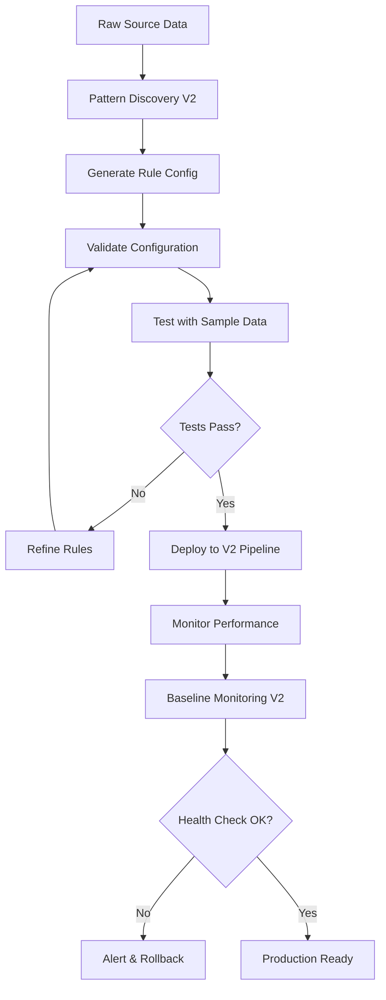

# Automation Helpers V2 Integration Plan

## Executive Summary

This document analyzes the existing automation helper scripts and defines how they will integrate with the V2 pipeline architecture. The current helpers demonstrate sophisticated pattern recognition and testing capabilities that are highly valuable, but require architectural updates to work with the configuration-driven, multi-stage V2 architecture.

**Key Finding**: The helpers currently work within a monolithic, imperative architecture but can be successfully evolved to support V2's declarative, modular approach while preserving their core value.

---

## Current Automation Helper Scripts Analysis

### 1. **pattern-discovery.js** - Pattern Identification Engine

**Current State**: ✅ **Production Ready**
- **Purpose**: Analyzes manual university mappings to identify automation opportunities
- **Input**: `frontend/public/data/manual-university-mapping.json`
- **Output**: Console analysis with pattern suggestions and risk assessment

**Key Capabilities**:
- Analyzes 10+ predefined patterns (UC System, Medical University, hyphen normalization)
- Provides risk assessment (VERY_LOW, LOW, MEDIUM, HIGH)
- Calculates automation potential and frequency analysis
- Generates implementation code snippets
- Auto-generates test scripts with `--generate-tests` flag

**Current Architecture**:
```javascript
// V1 Pattern Definition (Hardcoded)
const patterns = [
  {
    name: 'ucSystemCampuses',
    regex: /University of California,?\s*([A-Za-z\s]+)/g,
    replacement: 'University of California $1',
    riskLevel: 'VERY_LOW'
  }
];
```

### 2. **pattern-tester.js** - Safe Pattern Validation

**Current State**: ✅ **Production Ready**
- **Purpose**: Tests automation patterns safely before implementation
- **Input**: Pattern name and JavaScript code as command-line arguments
- **Output**: Pass/fail validation with automatic rollback

**Key Capabilities**:
- Establishes baseline university counts before testing
- Creates automatic backups via git
- Implements patterns directly in `canonicalizeName()` function
- Runs full aggregation pipeline to validate results
- Automatic rollback on failures (count changes >2 universities)
- Supports dry-run mode for logic testing only

**Current Workflow**:
```bash
# Test a new pattern safely
node scripts/automation-helpers/pattern-tester.js "medical_university_pattern" "cleaned = cleaned.replace(/pattern/, 'replacement');"
```

### 3. **baseline-monitor.js** - System Health Monitoring

**Current State**: ✅ **Production Ready**
- **Purpose**: Monitors university count and system health
- **Input**: System state via file analysis and script execution
- **Output**: Health status reports and system metrics

**Key Capabilities**:
- Tracks university counts via aggregation script execution
- Monitors manual mapping file changes
- Detects duplicate universities in final output
- Validates file integrity (JSON parsing, file existence)
- Compares current state with saved baselines
- Provides comprehensive health checks

---

## Integration Challenges and Requirements

### Challenge 1: Data Source Compatibility

**Current V1 Format**:
```json
{
  "originalName": "University of California - Berkeley",
  "suggestedStandardizedName": "University of California Berkeley"
}
```

**Required V2 Format**:
```json
{
  "canonical_id": "canonical-0001",
  "canonical_name": "University of California Berkeley",
  "country": "USA",
  "aliases": ["UC Berkeley", "University of California - Berkeley"]
}
```

**Solution**: Data format adapters for seamless transition

### Challenge 2: Pattern Application Architecture

**Current V1 Method** (Direct code injection):
```javascript
// Injected into canonicalizeName() function
cleaned = cleaned.replace(/^Medical University of (.+)$/i, 'Medical University $1');
```

**Required V2 Method** (Configuration-driven):
```json
{
  "transformationRules": {
    "universityNames": {
      "enhanced": [
        {
          "name": "medical_university_of_removal",
          "type": "regex_replace",
          "pattern": "^Medical University of (.+)$",
          "replacement": "Medical University $1",
          "flags": "i",
          "riskLevel": "LOW",
          "frequency": 12
        }
      ]
    }
  }
}
```

**Solution**: Pattern extraction engine and configuration generation tools

### Challenge 3: Testing Integration Points

**Current V1 Testing** (End-to-end):
```bash
# Test by running complete aggregation
node scripts/scrape-rankings.js
```

**Required V2 Testing** (Stage-by-stage):
```bash
# Test normalization stage only
node v2-pipeline/normalize.js --source=qs --config=test-rules.json --validate
```

**Solution**: Stage-specific test harnesses and validation tools

---

## V2 Integration Strategy

### Phase 1: Data Bridge Development (Immediate Priority)

#### 1.1 Create Format Adapters
- `v2-pipeline/adapters/canonical-bridge.js` - Convert between V1 and V2 formats
- `v2-pipeline/adapters/pattern-extractor.js` - Extract patterns from canonical list
- `v2-pipeline/adapters/legacy-compatibility.js` - Maintain V1 script compatibility

#### 1.2 Modify Existing Scripts
```javascript
// Updated pattern-discovery.js with V2 compatibility
const PatternDiscovery = {
  // V1 mode (default for backward compatibility)
  analyzeManualMappings(mappingsFile) { /* existing logic */ },
  
  // V2 mode (new functionality)
  analyzeCanonicalList(canonicalFile) {
    const universities = loadCanonicalList(canonicalFile);
    return this.findPatternsInAliases(universities);
  },
  
  // Output V2 configuration format
  generateV2Config(patterns) {
    return {
      transformationRules: {
        universityNames: {
          enhanced: patterns.map(p => this.convertToV2Format(p))
        }
      }
    };
  }
};
```

### Phase 2: Configuration Engine Integration (Core Development)

#### 2.1 Pattern Extraction Tools
```javascript
// New: v2-pipeline/extract-v1-patterns.js
function extractExistingPatterns() {
  // Mine canonicalizeName() function for existing rules
  // Convert hardcoded patterns to V2 configuration format
  // Validate extracted patterns against test data
}
```

#### 2.2 Enhanced Pattern Discovery
```javascript
// Enhanced pattern-discovery.js with V2 capabilities
const V2PatternDiscovery = {
  // Analyze canonical list for improvement opportunities
  analyzeCanonicalList(canonicalFile) {
    const universities = loadCanonicalList(canonicalFile);
    const aliasPatterns = this.findAliasPatterns(universities);
    const countryPatterns = this.findCountryPatterns(universities);
    return this.rankPatternsBy Risk(aliasPatterns, countryPatterns);
  },
  
  // Output structured V2 configurations
  generateRuleConfig(patterns, source) {
    return {
      metadata: {
        source: source,
        generatedBy: 'pattern-discovery-v2',
        confidence: this.calculateConfidence(patterns)
      },
      transformationRules: patterns
    };
  }
};
```

#### 2.3 V2 Pattern Testing
```javascript
// New: v2-pipeline/test-rule-config.js
const V2PatternTester = {
  // Test configuration files against sample data
  testConfiguration(configFile, sampleData) {
    const rules = loadRuleConfig(configFile);
    const results = this.applyRules(rules, sampleData);
    return this.validateResults(results);
  },
  
  // Stage-specific testing
  testNormalizationStage(configFile, rawData) {
    // Test only normalization rules
  },
  
  testMatchingStage(normalizedData, canonicalList) {
    // Test matching against canonical list
  }
};
```

### Phase 3: V2 Native Helpers (Advanced Features)

#### 3.1 Canonical List Analysis
```javascript
// New: v2-pipeline/canonical-analyzer.js
const CanonicalAnalyzer = {
  // Find optimization opportunities in canonical list
  findDuplicatePatterns(canonicalList) {
    // Identify universities with similar aliases
    // Suggest consolidation opportunities
  },
  
  findMissingAliases(canonicalList, sourceData) {
    // Compare against raw source data
    // Suggest additional aliases for better matching
  },
  
  validateCanonicalIntegrity(canonicalList) {
    // Check for inconsistencies, duplicates, invalid entries
  }
};
```

#### 3.2 Cross-Source Validation
```javascript
// New: v2-pipeline/cross-source-validator.js
const CrossSourceValidator = {
  // Validate patterns work across all ranking sources
  validateAcrossSources(ruleConfig, allSources) {
    const results = {};
    for (const source of allSources) {
      results[source] = this.testRulesOnSource(ruleConfig, source);
    }
    return this.analyzeConsistency(results);
  }
};
```

#### 3.3 Performance Analysis
```javascript
// New: v2-pipeline/rule-performance-analyzer.js
const RulePerformanceAnalyzer = {
  // Measure rule effectiveness and performance
  analyzeRulePerformance(rules, testData) {
    return {
      accuracy: this.measureAccuracy(rules, testData),
      speed: this.measureProcessingSpeed(rules, testData),
      coverage: this.measureCoverage(rules, testData),
      suggestions: this.generateOptimizations(rules)
    };
  }
};
```

### Phase 4: Migration and Deployment Strategy

#### 4.1 Backward Compatibility Layer
```javascript
// v2-pipeline/compatibility-layer.js
const V1Compatibility = {
  // Run V1 scripts in V2 environment
  runV1Script(scriptName, args) {
    // Provide V1 data format
    // Execute V1 script
    // Convert results to V2 format
  },
  
  // Gradual migration support
  enableDualMode() {
    // Run both V1 and V2 systems in parallel
    // Compare results for validation
  }
};
```

#### 4.2 Migration Tools
```javascript
// v2-pipeline/migration-helper.js
const MigrationHelper = {
  // Migrate existing manual mappings
  migrateManualMappings(v1MappingFile) {
    const v1Mappings = loadV1Mappings(v1MappingFile);
    const canonicalEntries = this.convertToCanonical(v1Mappings);
    return this.mergeWithExistingCanonical(canonicalEntries);
  },
  
  // Extract and convert V1 patterns
  extractV1Patterns() {
    const patterns = this.mineCanonicalizeFunction();
    return this.convertPatternsToV2Config(patterns);
  }
};
```

---

## Updated Development Workflow

### V2 Automation Helper Workflow



### Integration Points with V2 Pipeline

1. **Normalization Stage**: Rule configuration files
2. **Matching Stage**: Canonical list updates
3. **Manual Review**: Pattern suggestions for unmatched universities
4. **Quality Assurance**: Continuous monitoring and validation

---

## Required Modifications Summary

### Immediate Changes (Phase 1)

#### pattern-discovery.js
```javascript
// Add V2 compatibility mode
if (process.argv.includes('--v2-mode')) {
  const canonicalFile = process.argv[process.argv.indexOf('--canonical') + 1];
  const patterns = analyzeCanonicalList(canonicalFile);
  const v2Config = generateV2Configuration(patterns);
  console.log(JSON.stringify(v2Config, null, 2));
}
```

#### pattern-tester.js
```javascript
// Add configuration testing mode
if (process.argv.includes('--test-config')) {
  const configFile = process.argv[process.argv.indexOf('--config') + 1];
  const result = testRuleConfiguration(configFile);
  console.log(`Configuration test: ${result.passed ? 'PASSED' : 'FAILED'}`);
}
```

#### baseline-monitor.js
```javascript
// Add canonical list monitoring
function monitorCanonicalList() {
  const canonical = loadCanonicalList('canonical-universities.json');
  const health = validateCanonicalIntegrity(canonical);
  return {
    totalUniversities: canonical.length,
    sourceCoverage: calculateSourceCoverage(canonical),
    integrityScore: health.score,
    issues: health.issues
  };
}
```

### Core Changes (Phase 2)

#### New Scripts Required
- `v2-pipeline/pattern-discovery-v2.js` - V2-native pattern discovery
- `v2-pipeline/rule-config-tester.js` - Configuration file testing
- `v2-pipeline/canonical-pattern-analyzer.js` - Canonical list analysis

### Advanced Changes (Phase 3)

#### Enhanced Capabilities
- Cross-source pattern validation
- Performance optimization suggestions  
- Automated rule refinement
- Continuous improvement recommendations

---

## Success Metrics

### Automation Efficiency
- **Pattern Discovery Rate**: New patterns identified per analysis cycle
- **Rule Accuracy**: Percentage of patterns that pass validation
- **Processing Speed**: Time to analyze and generate configurations

### Integration Success
- **V2 Compatibility**: Percentage of V1 functionality preserved in V2
- **Configuration Coverage**: Percentage of manual mappings converted to rules
- **Migration Completeness**: Successful transition from V1 to V2 workflow

### Quality Assurance
- **Canonical Integrity**: Health score of canonical university list
- **Cross-Source Consistency**: Agreement between different ranking sources
- **Automated Match Rate**: Percentage of universities matched automatically

---

## Risk Mitigation

### Technical Risks
1. **Data Format Incompatibility**: Mitigated by comprehensive adapters
2. **Performance Degradation**: Addressed through incremental testing
3. **Configuration Complexity**: Reduced via schema validation and documentation

### Process Risks
1. **Migration Complexity**: Addressed through phased approach and dual-mode operation
2. **User Adoption**: Mitigated by maintaining familiar interfaces
3. **Rollback Requirements**: Ensured through git-based versioning and automated testing

---

## Conclusion

The existing automation helper scripts represent valuable assets that can be successfully evolved for the V2 pipeline. The integration strategy preserves their core capabilities while enhancing them with V2's configuration-driven architecture.

**Key Success Factors:**
1. **Phased Migration**: Gradual transition maintains stability
2. **Backward Compatibility**: Preserves existing workflows during transition
3. **Enhanced Capabilities**: V2 architecture enables more sophisticated analysis
4. **Quality Assurance**: Comprehensive validation ensures reliable operation

The integration will transform the helpers from V1's imperative, monolithic approach to V2's declarative, modular architecture while preserving and enhancing their valuable pattern recognition and testing capabilities.